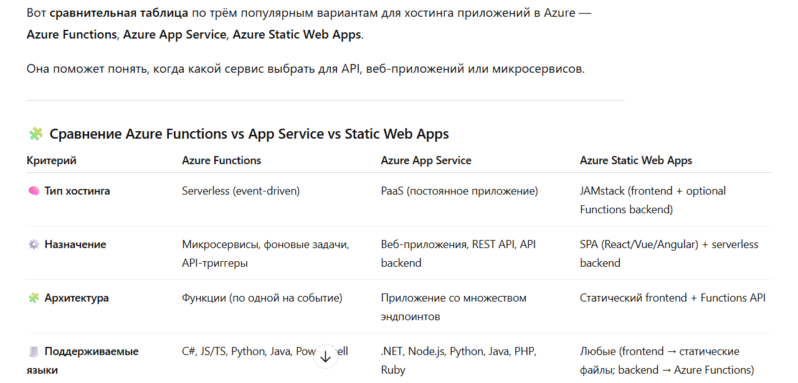
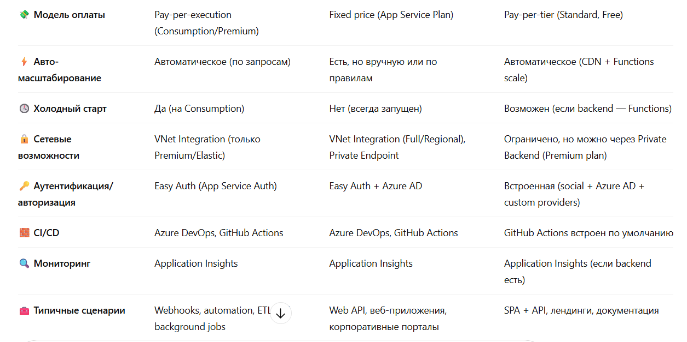
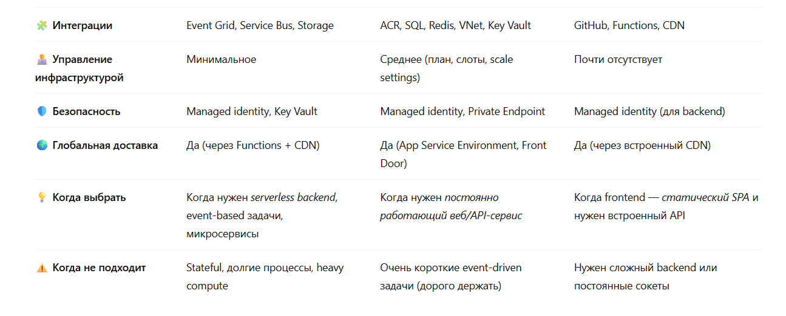

### Created Terraform configuration files with [kilocode](https://kilocode.ai/) for all the specified Azure resources. 

The files include:

`providers.tf`: Configures the Azure and Azure DevOps providers

`variables.tf`: Defines input variables for resource group, location, and Azure DevOps credentials

`main.tf`: Contains all the resource definitions for the Azure services you requested

The configuration covers:

- Azure Virtual Network with subnet
- Azure API Management
- Azure App Services (standard and container-based)
- Azure Container Registry
- Azure Function App
- Azure Static Web Apps
- Azure Entra ID (Azure AD application and service principal)
- Azure Entra External ID (Azure AD B2C directory)
- Azure SQL Server and database
- Azure Application Insights
- Azure Monitor (action group and metric alert)
- Azure DevOps project, pipeline, and variable group

To deploy these resources, you'll need to:

Initialize Terraform: `terraform init`
Plan the deployment: `terraform plan`
Apply the changes: `terraform apply`
Make sure to set the required variables (org_service_url and personal_access_token for Azure DevOps) before running terraform apply.

### Описание Azure сервисов на русском

Вот твой текст с аккуратно вставленными **пустыми строками** между блоками, чтобы он красиво отображался в Markdown-документе и хорошо читался 👇

---

#### Azure Virtual Network (VNet)

**Что это:** приватная виртуальная сеть в Azure — логический изолированный сегмент сети в облаке, аналог локальной сети (VLAN/VRF).

**Ключевые возможности:** подсети, адресные пространства (CIDR), NSG (Network Security Groups), UDR (route tables), VPN Gateway, ExpressRoute, peering (VNet-peering), Azure Firewall, DDoS Protection, Private Link, service endpoints, DNS.

**Сценарии:** хостинг приложений, которые требуют приватной сети; гибридные соединения (on-prem ↔ Azure) через VPN/ExpressRoute; многослойные архитектуры (front/back); изоляция сред (dev/prod).

**Интеграции:** все PaaS/IaaS (VM, AKS, App Service VNet Integration через Private Endpoint или regional VNet Integration), Private Link для сервисов (Azure SQL, Storage).

**Best practices:** проектировать CIDR с запасом, использовать NSG для сегментации, применять Azure Firewall/Policy, логировать (NSG flow logs), использовать Private Endpoints вместо service endpoints для безопасности.

**Подводные камни:** пересечение CIDR при peering/ExpressRoute; лимиты (число маршрутов, пиковые объёмы); неверная настройка NSG/UDR может привести к недоступности.

---

#### Azure API Management (APIM)

**Что это:** управляемый шлюз/платформа для публикации, защиты, монетизации и мониторинга API.

**Ключевые возможности:** проксирование API, политика (transformation, rate limit, auth, CORS), developer portal, подписки/ключи, OAuth/OpenID Connect, analytics, versioning, caching, mock responses, revisioning, products.

**Сценарии:** публикация внутренних/внешних REST API, агрегация микросервисов, добавление кэширования/логики без правок кода, exposing backend для партнёров.

**Интеграции:** Azure Functions, App Service, Logic Apps, Kubernetes Ingress, Azure AD.

**Best practices:** использовать policies для rate limiting/quotas, защищать с помощью JWT/OAuth, включать logging/monitoring, продумывать версионирование и product/subscription модель.

**Подводные камни:** стоимость (особенно Premium tier нужен для VNet/HA), сложность политик при большом количестве трансформаций.

---

#### Azure App Service

**Что это:** PaaS-платформа для хостинга веб-приложений, API и мобильных backend'ов (поддерживает .NET, Java, Node.js, Python, PHP, Ruby).

**Ключевые возможности:** авто-масштаб, слоты деплоя (staging/production), встроенный CI/CD, managed certificates, custom domains, scaling, интеграция с VNet (VNet Integration/Private Endpoint для ASE).

**Сценарии:** быстрый деплой веб-приложений/REST API без управления инфраструктурой.

**Интеграции:** Azure DevOps/GitHub Actions, Azure SQL, Redis, Application Insights.

**Best practices:** использовать deployment slots, health probes, connection strings в Key Vault/Config, резервное копирование, включать App Insights.

**Подводные камни:** ограниченная контроль над ОС по сравнению с VM; для изоляции/высокой безопасности использовать App Service Environment (ASE) — дороже.

---

#### Azure App Service for Containers

**Что это:** App Service, но запуск контейнеров (одиночных или multi-container via Docker Compose). Позволяет запускать custom container images без Kubernetes.

**Ключевые возможности:** поддержка приватных контейнерных реестров, настройка контейнера/команд запуска, контейнерные переменные окружения, масштабирование.

**Сценарии:** простые контейнерные веб-приложения, когда Kubernetes — overkill.

**Интеграции:** Azure Container Registry (ACR), Docker Hub, CI/CD.

**Best practices:** использовать readiness/liveness probes, хранить секреты в Key Vault, мониторить контейнеры via App Insights.

**Подводные камни:** не подходит для сложных оркестраций/мультисервисных систем — для этого AKS лучше.

---

#### Azure Container Registry (ACR)

**Что это:** приватный реестр контейнерных образов на Azure (совместим с Docker Registry).

**Ключевые возможности:** хранение образов (Docker/OCI), image replication, geo-replication, content trust, AAD auth, admin user, интеграция с Tasks (image build in cloud).

**Сценарии:** хранение образов для AKS, App Service, ACI, Pipelines.

**Интеграции:** AKS (AAD, managed identities), Azure DevOps, GitHub Actions, ACR Tasks для автоматической сборки/сканирования.

**Best practices:** использовать AAD/MSI для доступа, включать георепликацию ближе к кластерам, сканирование уязвимостей (ACR Tasks или 3rd party).

**Подводные камни:** публичный доступ — отключать; чистка старых тегов/garbage collection.

---

#### Azure Function App

**Что это:** serverless платформа для запуска отдельных функций (event-driven) — поддерживает триггеры HTTP, Timer, Queue, Blob, Event Grid и т.д.

**Ключевые возможности:** consumption plan (оплата по вызовам), premium plan (включая VNet, Cores + pre-warmed), Durable Functions (orchestration), интеграции с bindings, auto-scale.

**Сценарии:** webhooks, ETL, background jobs, event processing, cron jobs, glue logic.

**Интеграции:** Event Grid, Service Bus, Storage, Cosmos DB, API Management.

**Best practices:** хранить конфигурации в App Settings/Key Vault, трассировать с App Insights, выбрать правильный план (consumption vs premium) в зависимости от холодного старта и VNet.

**Подводные камни:** холодный старт на consumption, ограничения времени выполнения (хотя premium удаляет некоторые лимиты).

---

#### Azure Static Web Apps

**Что это:** PaaS для статических сайтов + встроённый serverless backend (Azure Functions) — автоматический CI/CD из GitHub/GitLab.

**Ключевые возможности:** статические файлы + встроенные API routes (Functions), глобальный CDN, custom domains, authentication (built-in social providers).

**Сценарии:** SPA (React/Vue/Angular), документация, landing pages, JAMstack.

**Интеграции:** GitHub Actions, Azure Functions, Azure CDN.

**Best practices:** использовать встроенный auth для простых сценариев, подключать App Insights при необходимости.

**Подводные камни:** ограниченность в сложных backend сценариях — для этого Azure App Service/Functions отдельно.

---

#### Azure Entra ID (ранее Azure AD)

**Что это:** облачная идентичность и управление доступом (identity provider) — аутентификация и авторизация для пользователей и приложений.

**Ключевые возможности:** single sign-on (SSO), OAuth2/OpenID Connect, conditional access, multi-factor auth (MFA), B2B/B2C, managed identities, role-based access control (RBAC integration), Identity Protection.

**Сценарии:** централизованная аутентификация (корпоративные пользователи), приложения для сотрудников, SaaS-интеграции, service-to-service auth (managed identities).

**Интеграции:** все Azure сервисы, Microsoft 365, custom apps (OIDC/OAuth), third-party apps.

**Best practices:** включать MFA, настроить conditional access, использовать Conditional Access/Identity Protection, назначать доступ по принципу least privilege.

**Подводные камни:** сложная лицензирование для advanced фич; B2C имеет отдельный тариф/поведение.

---

#### Azure Entra External ID (в прошлом B2B collaboration / External Identities)

**Что это:** сервис для управления внешними идентичностями — приглашение внешних партнёров, клиентов (B2B, B2C), федерация с внешними IdP.

**Ключевые возможности:** B2B collaboration (гостевые учётки), B2C (customer identity), federation with social/enterprise IdPs, conditional access for external users.

**Сценарии:** предоставление внешним клиентам/партнёрам доступа к приложениям, self-service sign up, identity federation.

**Интеграции:** Entra ID, apps, API.

**Best practices:** ограничивать права гостевых пользователей, мониторить signin logs, применять conditional access.

**Подводные камни:** сложности с управлением гостями при масштабах; учет лицензирования (B2C имеет отдельные модели).

---

#### Azure SQL (Azure SQL Database / logical server)

**Что это:** управляемая СУБД на базе SQL Server — single database, elastic pools, managed instance. `Azure SQL Server` часто означает "logical server" как контейнер для БД.

**Ключевые возможности:** автоматические бэкапы, geo-replication, point-in-time restore, scaling DTU/vCore, Advanced Threat Protection, Azure AD auth, row-level security, in-memory OLTP.

**Сценарии:** OLTP базы, SaaS multi-tenant, lift-and-shift SQL Server workloads, BI/analytics (в связке с Synapse).

**Интеграции:** App Services, Functions, Power BI, Data Factory.

**Best practices:** выбирать правильный модель оплаты (DTU vs vCore), использовать Managed Instance для lift-and-shift с поддержкой SQL Agent и CLR, использовать Azure AD auth + managed identity, шифрование (TDE).

**Подводные камни:** совместимость с on-prem SQL Server (фичи могут отличаться), цена при больших нагрузках, сеть — использовать private endpoints.

---

#### Azure Application Insights

**Что это:** APM/telemetry сервис (часть Azure Monitor) для мониторинга приложений: метрики, логи, трассировки, ошибки, запросы.

**Ключевые возможности:** request/exception telemetry, distributed tracing, live metrics, perf diagnostics, smart detection, availability tests, integration with dashboards/alerts.

**Сценарии:** мониторинг производительности приложений, root-cause analysis, SLO/SLI сбор, alerts.

**Интеграции:** .NET/Java/Node/Python SDKs, App Service, Functions, Log Analytics, Grafana.

**Best practices:** настроить sampling, выделить environment names, включить dependency tracking, хранить в отдельном workspace для больших нагрузок.

**Подводные камни:** при высоких объёмах данных — стоимость, нужно контролировать sampling/retention.

---

#### Azure Monitor

**Что это:** платформа мониторинга и наблюдаемости для Azure и on-prem. Включает метрики, логи (Log Analytics workspace), alerts, dashboards, autoscale. App Insights — специализированная часть Azure Monitor для приложений.

**Ключевые возможности:** metrics, logs (Kusto query), alerts (metric/log-based), workbook, autoscale, network watcher, container insights.

**Сценарии:** централизованный мониторинг инфраструктуры, аналитика логов, оповещения о проблемах, SLO/SLI.

**Интеграции:** все Azure ресурсы, Grafana, ITSM, action groups (email, webhook, Logic Apps).

**Best practices:** один или несколько Log Analytics workspaces по потребностям, настроить retention, использовать queries для alerts, cost management (data ingestion).

**Подводные камни:** стоимость хранения логов/телеметрии, сложность KQL для новичков.

---

#### Azure DevOps Pipelines

**Что это:** CI/CD система (часть Azure DevOps) — pipelines for build and release (YAML pipelines).

**Ключевые возможности:** hosted agents (Microsoft hosted), self-hosted agents, stages/jobs/tasks, templates, variable groups, service connections, approvals & gates, integrations with repos (Azure Repos, GitHub).

**Сценарии:** CI builds, automated testing, CD to AKS/App Service, multi-stage pipelines for deployments.

**Интеграции:** ACR, AKS, Azure CLI, Terraform, Helm, SonarQube, Artifacts, GitHub.

**Best practices:** use YAML pipelines in repo, use variable groups/Key Vault for secrets, use hosted pools or secure self-hosted agents, cache dependencies, parallel jobs for speed.

**Подводные камни:** limits on parallel jobs for free tiers; secrets handling — use service connections or Key Vault.

---

#### Azure DevOps Library (Variable Groups)

**Что это:** Library — место хранения переменных/секретов (variable groups) и артефактов в Azure DevOps. Позволяет централизовать конфигурации и секреты (можно подключать Azure Key Vault).

**Ключевые возможности:** переменные (plain/секреты), link to Key Vault secrets, scope to pipelines, templates.

**Сценарии:** централизованное хранение connection strings, credentials, environment variables для CI/CD.

**Best practices:** хранить секреты в Azure Key Vault и подключать через variable groups; ограничить доступ по security; использовать service connections.

**Подводные камни:** хранение секретов прямо в Library менее безопасно, лучше Key Vault; управление правами доступа.

---

